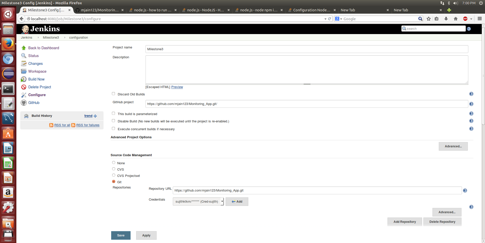
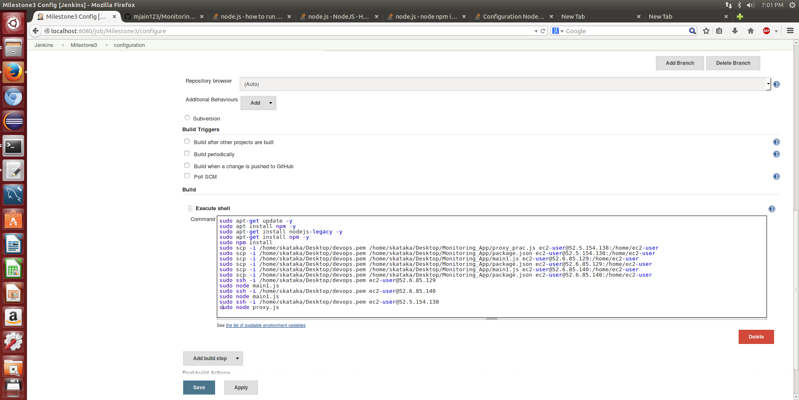
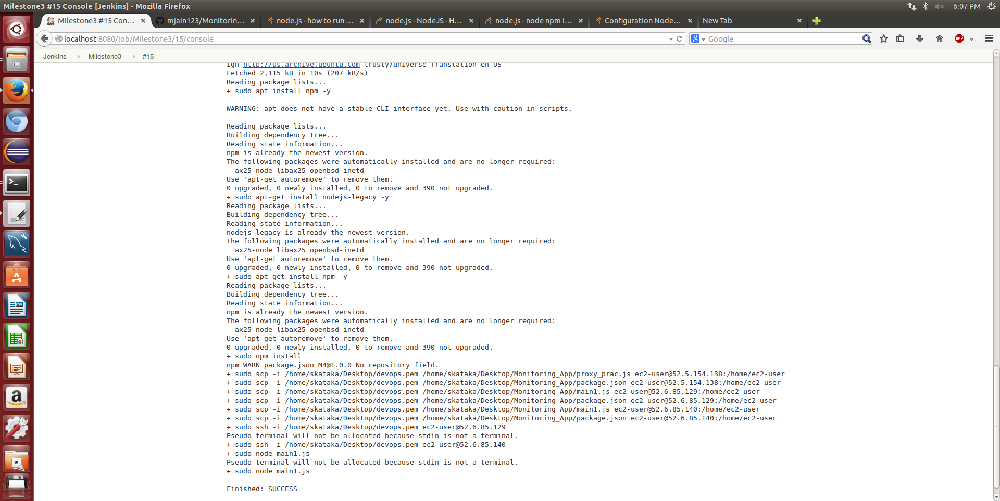
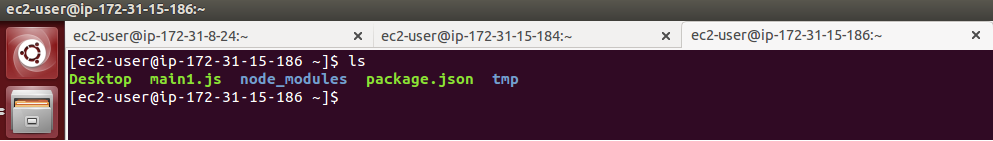
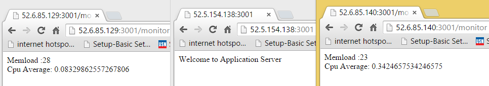
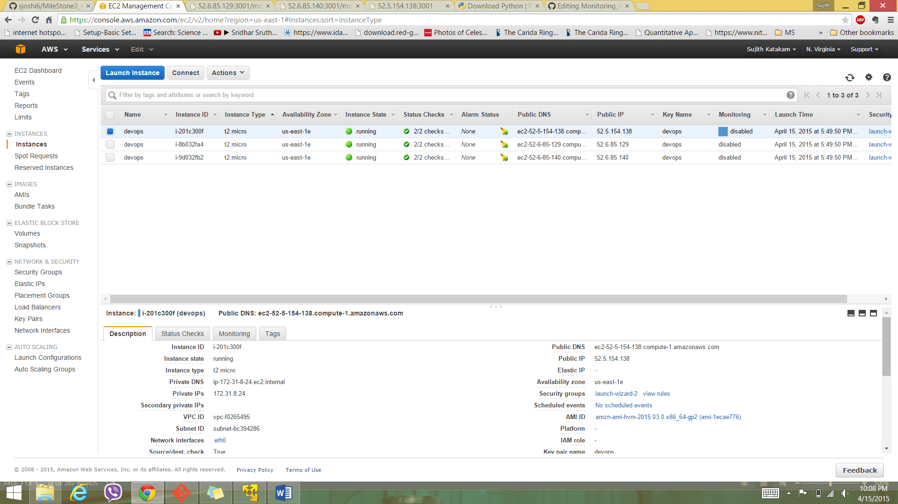
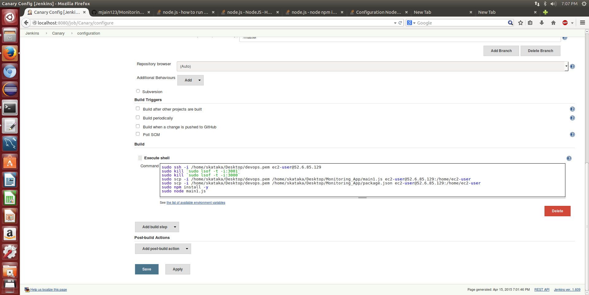
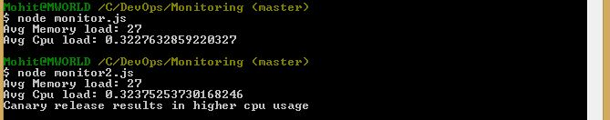

#### Milestone - Deployment (Monitoring_App)

In this MILESTONE, we will extend our deployment pipeline to support deployment to real machine, and using a canary release strategy.

Deployment Architecture - 
EC2 machines - 1 Proxy Server, 2 Application Servers

#### Properties

##### Task 1 - The ability to configure a deployment environment automatically, using a configuration management tool, such as ansible, or configured using vagrant/docker.

For task 1, 
  - To meet this requirement, we have used ansible.
  - Using ansible playbook, we have done required basic configuration of deployment environment. Our playbook looks like this -

```
---
- hosts: all

  tasks:
    - name: Install yum packages
      yum: name={{item}} state=latest enablerepo=epel
      sudo: yes
      with_items:
        - git
        - nodejs
        - npm
```

In this playbook, we have defined a task which will install basic git, node, npm and node based on the list of hosts given to it.

To give all the necessary hosts to this playbook, we created a inventory file which has the list of our nodes (ec2 instances).

```
[web0]
node0 ansible_ssh_host=52.6.85.129 ansible_ssh_user=ec2-user ansible_ssh_private_key_file=./keys/node0.key

node1 ansible_ssh_host=52.6.85.140 ansible_ssh_user=ec2-user ansible_ssh_private_key_file=./keys/node0.key

[web1]
node2 ansible_ssh_host=52.5.154.138 ansible_ssh_user=ec2-user ansible_ssh_private_key_file=./keys/node0.key
```

Thus the configuration task is finished

##### Task 2 - The ability to deploy a self-contained/built application to the deployment environment. That is, this action should occur after a build step in your pipeline.

For Task 2,
  - We used Jenkins.
  - In jenkins, we created a new job to perfrom the build operation. In the build action, we wrote shell script to perform necessary installation, export the built artifacts to remote machine and perform 'npm install' to install all the required dependencies. 
  - Then using 'ssh' command we logged into the remote machine. For 'ssh' onto remote system, we used 'ssh -i <security_key> <user>@<public DNS>'. The security key is obtained from the access key pair of the user in aws.amazon.com
  - On one of the remote machine, we executed our app and on the other remote machine, we executed proxy.




The below screenshots gives the result obtained (BUILD: SUCCESS) on making the build, pushing the files onto remote machines and running app and proxy on respective remote machines.



Here is a screenshot that shows that the files are copied onto our remote system and 'npm install' was executed to get the necessary node module.



This screenshot shows accessing the app server and proxy server of the remote machines using their respective public ip.



##### Task 3 - The deployment must occur on an actual remote machine/VM (e.g. AWS, droplet, VCL), and not a local VM.

For Task 3, 
  - As a basic configuration, we have created 3 ec2 instances, two of which will work as app and the third as proxy.
  - Use of two 2 ec2 instances is significant to demonstrate canary release.



##### Task 4 - The ability to perform a canary release.

For Task 4,
  - We used Jenkins.
  - In jenkins, we created a new job to perform the canary release. In the build action, we wrote shell script to perform necessary installation, export the built artifacts to remote machine and perform 'npm install' to install all the required dependencies only one of the machines (as it is a canary release). 
  - Then using 'ssh' command we logged into the remote machine.
  - On one of the remote machine, we executed our app and on the other remote machine, we executed proxy.



##### Task 5 - The ability to monitor the deployed application for alerts/failures (using at least 2 metrics).

First we have added a route in the application /monitor which returns the memory load and cpu usage of the instance.

To monitor the deployed application, we have written nodejs script - (file: monitor.js). After we deploy the stable code, we execute this script which in turn makes 10 requests to the proxy ( 5 requests to each application server ) and writes the value of average memory load and cpu usage in file.json. 

After performing the canary release through jenkins, we execute another script( file:monitor2.js). This script again makes similar 10 requests. After the requests, it compares this value with the previous results and alerts the user whether the canary release has resulted in more cpu consumption or memory load.

Code for monitoring after canary release -

```sh
var i = 0;
var totalmemoryload = 0;
var totalcpu = 0;

for( i=0;i<10;i++)
{
	request.get('http://52.5.154.138:3001/monitor', function(req,res) {
		var resp = JSON.parse(res.body);
		//console.log(resp.cpu);
		totalmemoryload = totalmemoryload + resp.memload;
		totalcpu = totalcpu + resp.cpu;
	});
	
}

setTimeout(function(req,res){
		var basememval = value.avgmem;
		var basecpuval = value.avgcpu;
		console.log("Avg Memory load: "+ totalmemoryload/10);
		console.log("Avg Cpu load: "+ totalcpu);
		if(basememval < (totalmemoryload/10))
			console.log("Canary release results in higher memory load");
		if(basecpuval < (totalcpu))
			console.log("Canary release results in higher cpu usage");
}, 1000);
```


